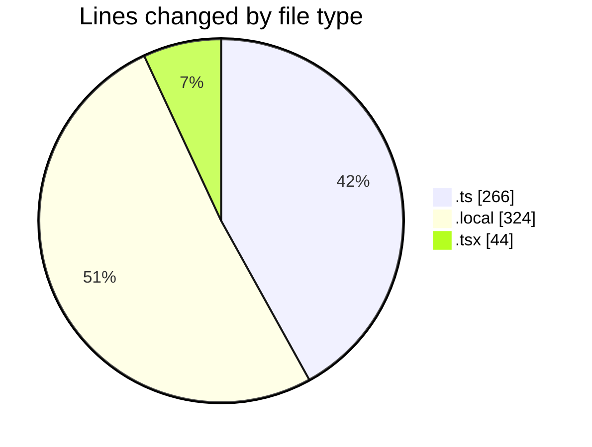
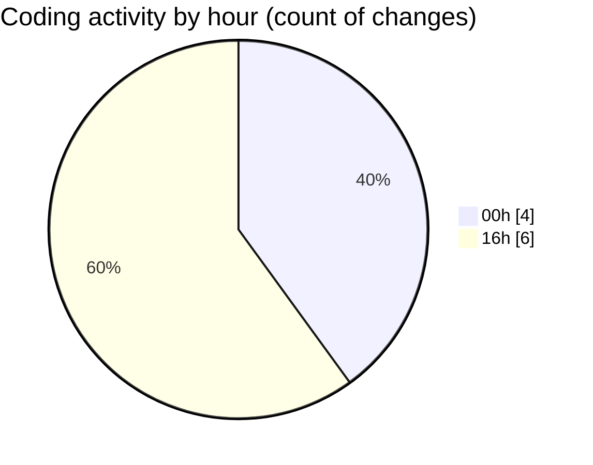

# FixMe24 - Activity Summary 

## Overall Statistics

| Stat                   | Value                                                             |
| ---------------------- | ----------------------------------------------------------------- |
| **Lines Added** (➕)   | 634                                          |
| **Lines Removed** (➖) | 0                                        |
| **Net Change** (↕)    | 634                |
| **Active Time** (⌚)   | 9 minutes |

## Modified Files
- **supabase.ts** (+1, -0)
- **.env.local** (+324, -0)
- **supabase.ts** (+1, -0)
- **CtaSection.tsx** (+44, -0)
- **supabase-admin.ts** (+39, -0)
- **seed-data.ts** (+172, -0)
- **execute-migration.ts** (+53, -0)

## Visualizations

### By File Type (Lines Changed)

### By Hour (Estimated Activity Count)

> **Last Updated:** 5/20/2025, 4:52:42 PM