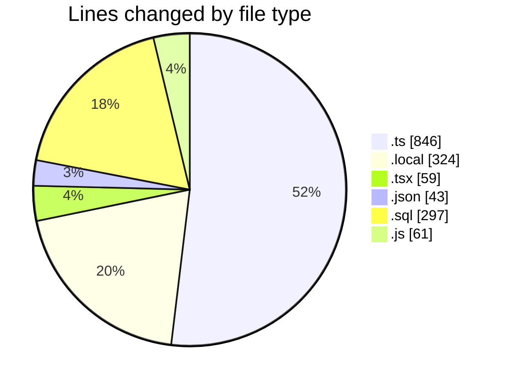
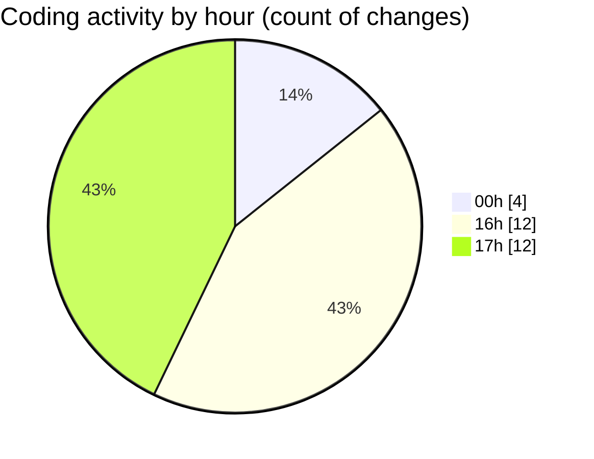

# FixMe24 - Activity Summary 

## Overall Statistics

| Stat                   | Value                                                             |
| ---------------------- | ----------------------------------------------------------------- |
| **Lines Added** (➕)   | 1628                                          |
| **Lines Removed** (➖) | 2                                        |
| **Net Change** (↕)    | 1626                |
| **Active Time** (⌚)   | 30 minutes |

## Modified Files
- **supabase.ts** (+1, -0)
- **.env.local** (+324, -0)
- **supabase.ts** (+1, -0)
- **CtaSection.tsx** (+59, -0)
- **supabase-admin.ts** (+39, -0)
- **seed-data.ts** (+175, -0)
- **execute-migration.ts** (+53, -0)
- **package.json** (+43, -0)
- **supabase-sql.ts** (+62, -0)
- **content-loader.ts** (+123, -0)
- **useSupabaseContent.ts** (+88, -0)
- **direct-sql-execution.sql** (+297, -0)
- **direct-db-setup.ts** (+127, -1)
- **setup-database.js** (+60, -1)
- **verify-database.ts** (+176, -0)

## Visualizations

### By File Type (Lines Changed)

### By Hour (Estimated Activity Count)

> **Last Updated:** 5/20/2025, 5:12:42 PM