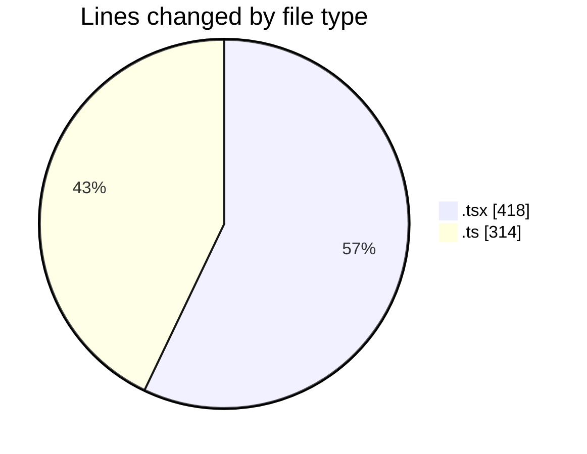
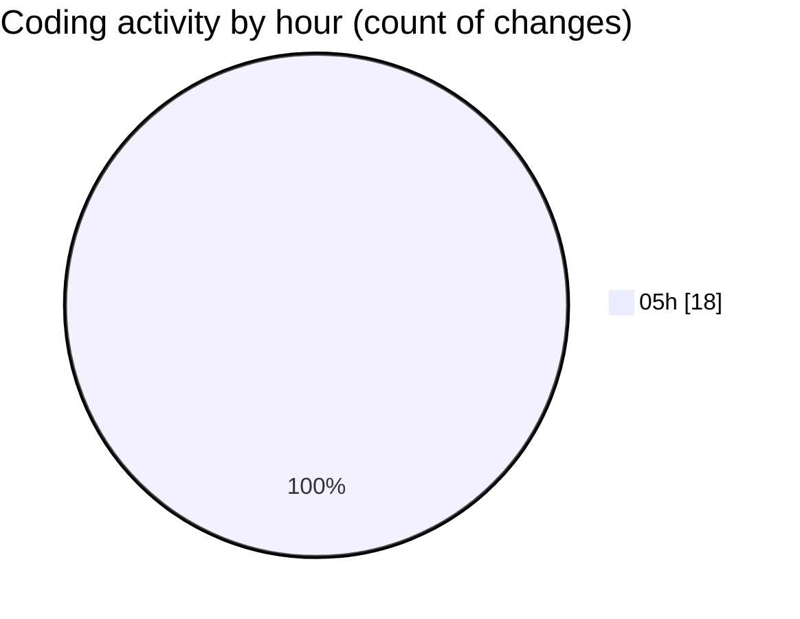

# FixMe24 - Activity Summary 

## Overall Statistics

| Stat                   | Value                                                             |
| ---------------------- | ----------------------------------------------------------------- |
| **Lines Added** (➕)   | 725                                          |
| **Lines Removed** (➖) | 7                                        |
| **Net Change** (↕)    | 718                |
| **Active Time** (⌚)   | 17 minutes |

## Modified Files
- **Header.tsx** (+212, -1)
- **Footer.tsx** (+108, -1)
- **MainLayout.tsx** (+29, -1)
- **LanguageSwitcher.tsx** (+65, -1)
- **useAuth.ts** (+141, -1)
- **index.ts** (+34, -1)
- **en.ts** (+136, -1)

## Visualizations

### By File Type (Lines Changed)

### By Hour (Estimated Activity Count)

> **Last Updated:** 5/21/2025, 5:57:52 AM