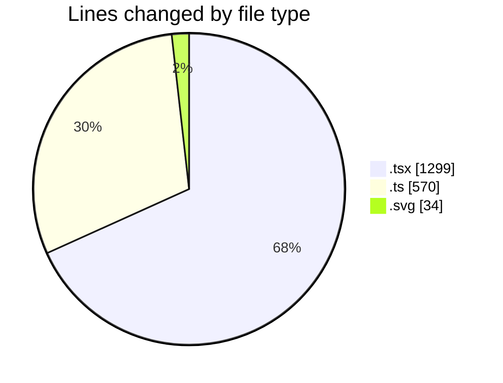
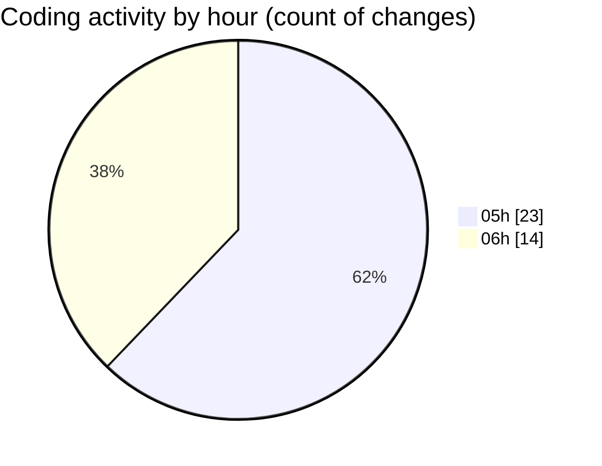

# FixMe24 - Activity Summary 

## Overall Statistics

| Stat                   | Value                                                             |
| ---------------------- | ----------------------------------------------------------------- |
| **Lines Added** (➕)   | 1891                                          |
| **Lines Removed** (➖) | 12                                        |
| **Net Change** (↕)    | 1879                |
| **Active Time** (⌚)   | 41 minutes |

## Modified Files
- **Header.tsx** (+212, -1)
- **Footer.tsx** (+108, -1)
- **MainLayout.tsx** (+29, -1)
- **LanguageSwitcher.tsx** (+65, -1)
- **useAuth.ts** (+141, -1)
- **index.ts** (+34, -1)
- **en.ts** (+136, -1)
- **de.ts** (+136, -1)
- **layout.tsx** (+54, -0)
- **page.tsx** (+203, -0)
- **hero-illustration.svg** (+34, -0)
- **content.ts** (+118, -1)
- **QueryProvider.tsx** (+28, -1)
- **page.tsx** (+155, -1)
- **page.tsx** (+268, -1)
- **page.tsx** (+170, -0)

## Visualizations

### By File Type (Lines Changed)

### By Hour (Estimated Activity Count)

> **Last Updated:** 5/21/2025, 6:07:52 AM